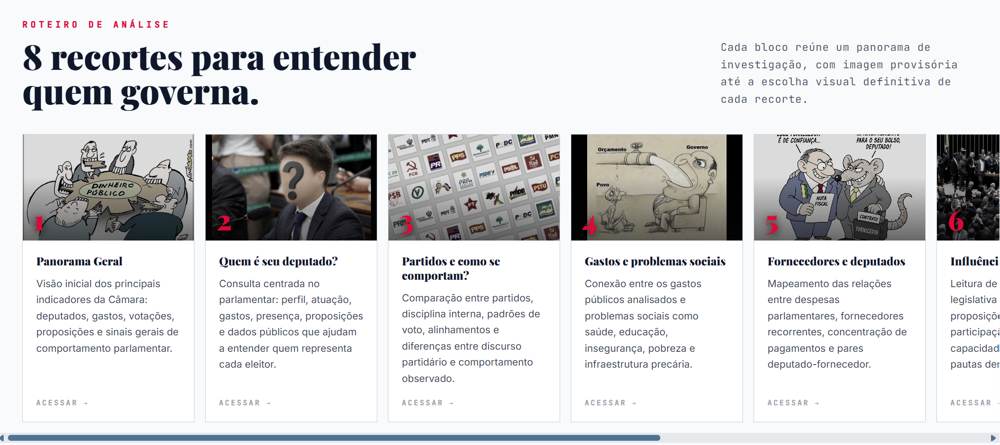
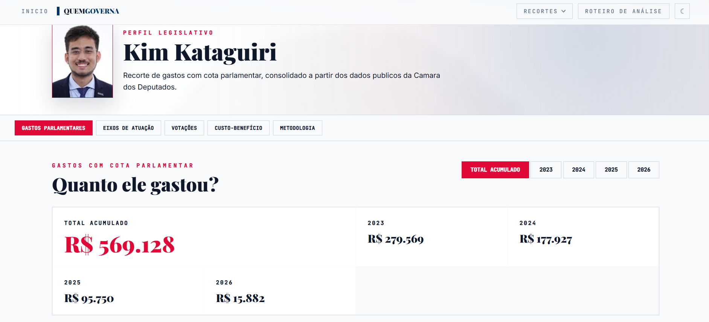
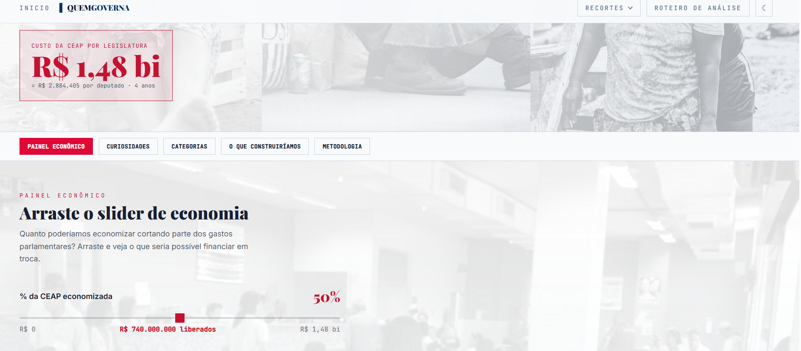
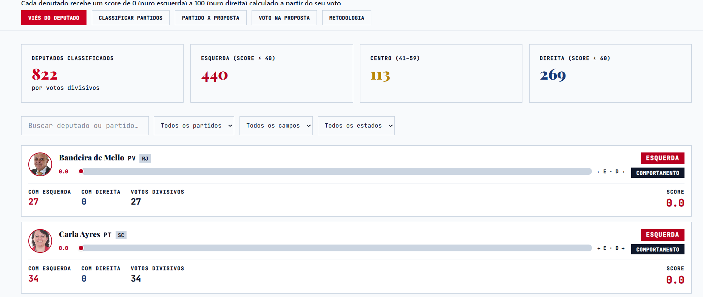
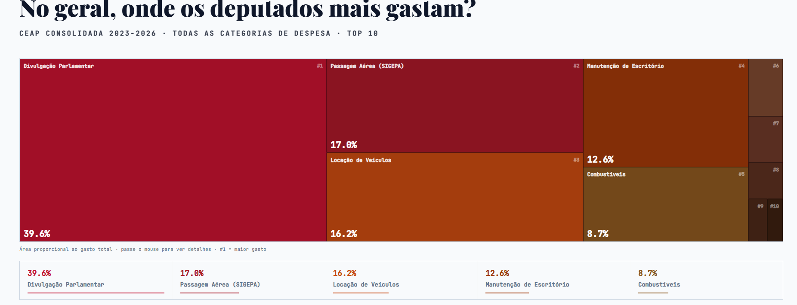

<div align="center">

# 🏛️ BDR — Análise de Gastos Públicos dos Deputados

### Plataforma de engenharia e visualização de dados para analisar gastos, fornecedores, votações, proposições e indicadores dos deputados federais brasileiros.


</div>

---

## 🔗 Links do Projeto

| Recurso                | Link                                                                                                                                             |
| ---------------------- | ------------------------------------------------------------------------------------------------------------------------------------------------ |
| 📦 Repositório         | [github.com/viniciusbtech/Projeto_analise_gastos_publicos_deputados](https://github.com/viniciusbtech/Projeto_analise_gastos_publicos_deputados) |


---

## 📖 Introdução

O **Quem governa** é um projeto de engenharia, análise e visualização de dados públicos da Câmara dos Deputados.

A aplicação reúne um pipeline ETL desenvolvido em Python, um banco de dados PostgreSQL executado com Docker, consultas analíticas em SQL, uma API construída com FastAPI e um dashboard desenvolvido com React, TypeScript e Vite.

O objetivo é transformar grandes volumes de dados legislativos em informações mais acessíveis, permitindo analisar:

* Gastos dos deputados.
* Empresas e fornecedores que receberam recursos.
* Categorias de despesas parlamentares.
* Proposições apresentadas e aprovadas.
* Participação em votações.
* Alinhamento partidário.
* Tendências ideológicas observadas nos votos.
* Escolaridade e perfil parlamentar.
* Indicadores de influência e custo-benefício.
* Relações entre deputados, partidos, fornecedores e votações.

O fluxo principal do projeto é:

```text
Arquivos CSV
    ↓
Limpeza e padronização com Python
    ↓
Enriquecimento dos dados
    ↓
Carga no PostgreSQL
    ↓
Consultas analíticas em SQL
    ↓
Exportação das respostas
    ↓
API FastAPI
    ↓
Dashboard React
```

### Estrutura principal

```text
Projeto_analise_gastos_publicos_deputados/
├── Banco/                    # PostgreSQL, Docker Compose e scripts SQL
├── catalogos/                # Catálogos auxiliares
├── dados_padronizados/       # Dados gerados após limpeza e padronização
├── dashboard/
│   ├── backend/              # API FastAPI
│   ├── frontend/             # Primeira interface React
│   ├── frontend-v2/          # Segunda versão da interface
│   └── frontend-v3/          # Interface mais recente
├── questoes/                 # Consultas e respostas das questões Q1 a Q13
├── src/                      # Pipeline ETL em Python
├── tabelas/                  # Dados brutos utilizados no processamento
├── tests/                    # Testes do pipeline de dados
├── .env.example              # Exemplo das variáveis de ambiente
├── Makefile                  # Atalhos para tarefas do projeto
└── requirements.txt          # Dependências Python
```

<!-- Estrutura conferida no repositório do projeto. -->

### Capturas de tela

<div align="center">


<br><br>




<br><br>




<br><br>




</div>

---

## 🛠️ Tecnologias

### 🎨 Frontend

| Tecnologia       | Utilização                                             |
| ---------------- | ------------------------------------------------------ |
| **React 18**     | Construção da interface e dos componentes do dashboard |
| **TypeScript**   | Tipagem e organização do código do frontend            |
| **Vite**         | Servidor de desenvolvimento e geração do build         |
| **Material UI**  | Componentes visuais e ícones                           |
| **Tailwind CSS** | Estilização e construção dos layouts                   |
| **ECharts**      | Gráficos e visualizações de dados                      |
| **Recharts**     | Gráficos complementares                                |
| **Radix UI**     | Componentes acessíveis de interface                    |
| **Lucide React** | Ícones utilizados no dashboard                         |
| **React Router** | Organização da navegação entre páginas                 |

### ⚙️ Backend

| Tecnologia        | Utilização                                             |
| ----------------- | ------------------------------------------------------ |
| **Python 3.11+**  | Pipeline ETL, scripts analíticos e backend             |
| **FastAPI**       | Desenvolvimento da API consumida pelo dashboard        |
| **Uvicorn**       | Servidor ASGI utilizado para executar a API            |
| **Pydantic**      | Validação e serialização dos dados retornados pela API |
| **HTTPX**         | Testes e comunicação HTTP                              |
| **Python Dotenv** | Carregamento das variáveis de ambiente                 |
| **WordCloud**     | Geração de nuvens de palavras                          |

### 🗄️ Banco de dados e dados

| Tecnologia        | Utilização                                               |
| ----------------- | -------------------------------------------------------- |
| **PostgreSQL 16** | Armazenamento relacional dos dados legislativos          |
| **Psycopg2**      | Comunicação entre Python e PostgreSQL                    |
| **SQL**           | Consultas e análises das questões Q1 a Q13               |
| **Pandas**        | Limpeza, transformação, agregação e exportação dos dados |
| **Scikit-learn**  | Apoio a análises estatísticas e identificação de padrões |
| **CSV**           | Formato de entrada e saída de parte dos dados            |

### 📊 Análise de redes

| Tecnologia         | Utilização                                               |
| ------------------ | -------------------------------------------------------- |
| **igraph**         | Construção e análise de grafos                           |
| **Leidenalg**      | Detecção de comunidades de votação pelo algoritmo Leiden |
| **Kappa de Cohen** | Medida de concordância utilizada na análise de votos     |

### 🧪 Testes

| Tecnologia                | Utilização                                         |
| ------------------------- | -------------------------------------------------- |
| **Pytest**                | Execução dos testes automatizados                  |
| **FastAPI TestClient**    | Testes dos endpoints da API                        |
| **HTTPX**                 | Validação do comportamento das respostas HTTP      |
| **Testes de contrato**    | Verificação da estrutura dos dados retornados      |
| **Testes de resiliência** | Validação do comportamento da API em casos de erro |

### 💻 Desenvolvimento e versionamento

| Tecnologia                  | Utilização                                  |
| --------------------------- | ------------------------------------------- |
| **Git**                     | Controle de versão                          |
| **GitHub**                  | Hospedagem e colaboração no projeto         |
| **PowerShell**              | Execução de scripts e automações no Windows |
| **Makefile**                | Atalhos para operações recorrentes          |
| **Ambiente virtual Python** | Isolamento das dependências                 |

### 🚀 Deploy e infraestrutura

| Tecnologia         | Utilização                                 |
| ------------------ | ------------------------------------------ |
| **Docker Compose** | Execução local do PostgreSQL e do pgAdmin  |
| **pgAdmin 4**      | Administração visual do banco de dados     |
| **Vite Build**     | Geração dos arquivos estáticos do frontend |

> O projeto ainda não possui uma configuração de deploy público para frontend, backend e banco de dados.

<!-- Dependências conferidas nos arquivos requirements.txt e package.json. -->

---

## ✨ Features

### 📊 Dashboard

* [x] Página inicial com apresentação do projeto.
* [x] Navegação entre diferentes áreas de análise.
* [x] Página de panorama geral.
* [x] Página de análise individual dos deputados.
* [x] Página de partidos.
* [x] Página de fornecedores.
* [x] Página de escolaridade.
* [x] Página de influência legislativa.
* [x] Página de ideologia.
* [x] Página de gastos e indicadores sociais.
* [x] Suporte a tema claro e escuro.
* [x] Tabelas com paginação.
* [x] Busca textual.
* [x] Ordenação de resultados.
* [x] Filtros por ano.
* [x] Filtros por deputado.
* [x] Filtros por partido.
* [x] Filtros por estado.
* [x] Filtros por escolaridade.
* [x] Filtros por eixo temático.
* [x] Visualização de gráficos de barras.
* [x] Visualização de gráficos empilhados.
* [x] Visualização de gráficos de dispersão.
* [x] Visualização de nuvens de palavras.
* [x] Visualização de relações entre partidos e ideologias.

### 🔄 Pipeline ETL

* [x] Leitura dos arquivos CSV brutos.
* [x] Limpeza e padronização dos dados.
* [x] Conversão e validação dos tipos das colunas.
* [x] Tratamento de valores ausentes.
* [x] Organização da ordem de carga das tabelas.
* [x] Enriquecimento de informações dos deputados.
* [x] Carregamento dos dados no PostgreSQL.
* [x] Registro de logs durante o processamento.
* [x] Auditoria de consistência dos dados.
* [x] Exportação automática das respostas analíticas.
* [x] Geração de arquivos padronizados para consumo posterior.

### ⚙️ API

* [x] Endpoint de verificação da saúde da API.
* [x] Endpoint com metadados do dashboard.
* [x] Endpoint genérico para consultar as questões analíticas.
* [x] Filtros por ano, eixo, partido, estado, deputado e escolaridade.
* [x] Busca textual nas respostas.
* [x] Paginação das tabelas.
* [x] Ordenação crescente e decrescente.
* [x] Limitação segura da quantidade de registros por página.
* [x] Endpoints específicos para gastos.
* [x] Consulta de resumo das despesas.
* [x] Consulta de gastos por categoria.
* [x] Consulta de gastos por deputado.
* [x] Consulta de fornecedores.
* [x] Consulta de contexto dos gastos.
* [x] Consulta de possíveis anomalias.
* [x] Consulta detalhada das anomalias encontradas.
* [x] Documentação automática com Swagger.

### 🧠 Questões analíticas

| Questão | Análise                                                     |
| ------- | ----------------------------------------------------------- |
| **Q1**  | Ranking de gastos totais por deputado                       |
| **Q2**  | Eixos temáticos e nuvens de palavras das proposições        |
| **Q3**  | Votos dos deputados por eixo temático                       |
| **Q4**  | Distribuição da escolaridade dos deputados                  |
| **Q5**  | Fornecedores com maior total recebido                       |
| **Q6**  | Relação entre escolaridade e indicadores parlamentares      |
| **Q7**  | Índice de custo-benefício dos deputados                     |
| **Q8**  | Influência legislativa e comunidades de votação             |
| **Q9**  | Viés ideológico e partidário observado nos votos            |
| **Q10** | Alinhamento interno e fidelidade dos partidos               |
| **Q11** | Rankings de participação, proposições e gastos dos partidos |
| **Q12** | Relação entre deputados e fornecedores                      |
| **Q13** | Distribuição dos gastos por categoria de despesa            |

### 🕸️ Comunidades de votação

A análise complementar da Q8:

* Considera somente votos binários `Sim` e `Não`.
* Exclui ausências, obstruções e abstenções da rede de concordância.
* Dá maior peso a votações mais divisivas.
* Utiliza Kappa de Cohen ponderado.
* Mantém somente pares com quantidade mínima de votações em comum.
* Detecta comunidades de deputados utilizando o algoritmo Leiden.

<!-- Funcionalidades conferidas na API, no registro das questões e nas páginas do frontend. -->

---

## ⌨️ Keyboard Shortcuts

O projeto não possui atalhos globais personalizados, como `Ctrl + K` ou `Ctrl + P`.

A interface utiliza recursos de acessibilidade que permitem navegar pelo teclado:

| Tecla         | Ação                                                    |
| ------------- | ------------------------------------------------------- |
| `Tab`         | Move o foco entre links, botões, filtros e cartões      |
| `Shift + Tab` | Retorna ao elemento anterior                            |
| `Enter`       | Abre o item selecionado ou confirma uma ação            |
| `Espaço`      | Ativa cartões e elementos interativos que estão em foco |
| `Esc`         | Fecha menus ou caixas de diálogo compatíveis            |

> `Tab`, `Enter` e `Espaço` são comportamentos de navegação e acessibilidade da interface, não atalhos globais exclusivos da aplicação.

### Sugestões de atalhos futuros

| Atalho sugerido    | Ação                               |
| ------------------ | ---------------------------------- |
| `Ctrl + K`         | Abrir a busca global               |
| `Ctrl + F`         | Focar o campo de busca da tabela   |
| `Ctrl + Shift + F` | Abrir o painel de filtros          |
| `Ctrl + D`         | Alternar entre tema claro e escuro |
| `Ctrl + E`         | Exportar os dados exibidos         |
| `Alt + 1`          | Abrir o panorama geral             |
| `Alt + 2`          | Abrir a análise de deputados       |
| `Alt + 3`          | Abrir a análise de partidos        |
| `Alt + 4`          | Abrir a análise de fornecedores    |
| `Esc`              | Limpar filtros ou fechar painéis   |

---

## 🔄 O Processo

### 1. Planejamento

O projeto começou com a definição das perguntas que deveriam ser respondidas a partir dos dados da Câmara dos Deputados.

As análises foram organizadas em questões independentes, abrangendo áreas como:

* Gastos parlamentares.
* Fornecedores.
* Proposições.
* Votações.
* Escolaridade.
* Partidos.
* Ideologia.
* Influência legislativa.
* Custo-benefício.
* Categorias de despesas.

Cada questão foi estruturada em uma pasta própria, contendo consultas, respostas e artefatos.

```text
questoes/
└── qN/
    ├── consultas/
    ├── respostas/
    └── artifacts/
```

### 2. Modelagem do banco

Os dados foram organizados em um modelo relacional PostgreSQL, com tabelas para entidades como:

* Deputados.
* Partidos.
* Gastos.
* Fornecedores.
* Eventos.
* Presenças.
* Proposições.
* Autores.
* Temas.
* Votações.
* Votos.
* Orientações partidárias.
* Escolaridade.

As relações entre essas tabelas permitem realizar consultas analíticas que combinam informações de diferentes fontes.

### 3. Desenvolvimento do pipeline ETL

O pipeline foi desenvolvido em Python e dividido em módulos responsáveis por:

* Ler os dados brutos.
* Limpar valores inconsistentes.
* Padronizar colunas.
* Aplicar mapeamentos.
* Enriquecer informações.
* Auditar a consistência dos dados.
* Carregar as tabelas no PostgreSQL.
* Exportar as respostas das análises.

```text
Extração → Limpeza → Padronização → Enriquecimento → Carga → Validação
```

### 4. Desenvolvimento das consultas

As perguntas analíticas foram implementadas com consultas SQL.

Cada consulta foi revisada para evitar problemas como:

* Duplicação causada por relacionamentos muitos-para-muitos.
* Contagens incorretas de deputados.
* Soma duplicada de gastos.
* Mistura entre diferentes legislaturas.
* Uso de nomes parlamentares inconsistentes.
* Classificação incorreta dos votos.
* Inclusão de ausências como concordância.

### 5. Desenvolvimento do backend

O backend foi criado com FastAPI para disponibilizar os resultados das análises ao frontend.

A API organiza os dados em respostas padronizadas contendo:

* Metadados.
* Indicadores.
* Colunas das tabelas.
* Registros paginados.
* Configuração dos gráficos.
* Filtros disponíveis.
* Informações metodológicas.

O backend também possui endpoints específicos para gastos, fornecedores, categorias e possíveis anomalias.

### 6. Desenvolvimento do frontend

O dashboard foi desenvolvido com React e TypeScript.

A interface foi organizada em páginas específicas para facilitar a exploração dos dados:

```text
Panorama
Deputados
Partidos
Fornecedores
Escolaridade
Influência
Ideologia
Gastos sociais
```

Os dados são apresentados por meio de:

* Tabelas.
* Rankings.
* Cards informativos.
* Gráficos.
* Nuvens de palavras.
* Filtros.
* Buscas.
* Indicadores comparativos.

### 7. Testes

Os testes automatizados foram desenvolvidos com Pytest.

O backend possui testes para:

* Endpoints da API.
* Contratos das respostas.
* Parser dos arquivos analíticos.
* Dados normalizados.
* Gastos.
* Filtros.
* Paginação.
* Tratamento de erros.
* Resiliência da aplicação.

O frontend pode ser validado por meio do build de produção.

### 8. Versionamento

O código foi versionado com Git e armazenado no GitHub.

O versionamento permitiu:

* Separar alterações por funcionalidade.
* Revisar implementações.
* Corrigir problemas sem perder versões anteriores.
* Integrar mudanças feitas por diferentes integrantes.
* Registrar a evolução do modelo de dados, consultas e dashboard.

### 9. Revisão

A revisão envolveu:

* Conferência das consultas SQL.
* Comparação dos resultados com os dados originais.
* Auditoria de contagens e somas.
* Validação das respostas da API.
* Verificação visual dos gráficos.
* Correção dos filtros.
* Revisão da interface.
* Execução dos testes automatizados.

### 10. Deploy

O projeto não possui deploy público.

A infraestrutura atual é executada localmente:

```text
PostgreSQL e pgAdmin → Docker Compose
Backend             → Uvicorn
Frontend            → Vite
```

O frontend também pode ser compilado para produção por meio do comando:

```bash
npm run build
```

---

## 🎓 O Que Eu Aprendi

Durante o desenvolvimento deste projeto, aprofundei meus conhecimentos em:

### Conhecimentos técnicos

* Modelagem de bancos de dados relacionais.
* Criação de relacionamentos entre entidades.
* Normalização e padronização de dados.
* Construção de pipelines ETL.
* Manipulação de arquivos CSV com Pandas.
* Tratamento de valores ausentes e inconsistentes.
* Carga de grandes volumes de dados no PostgreSQL.
* Desenvolvimento de consultas SQL complexas.
* Uso de agregações, junções, CTEs e funções de janela.
* Prevenção de duplicações em consultas.
* Validação da consistência dos resultados.
* Desenvolvimento de APIs REST com FastAPI.
* Validação de dados com Pydantic.
* Implementação de filtros e paginação.
* Criação de interfaces com React e TypeScript.
* Integração entre frontend e backend.
* Construção de gráficos e dashboards.
* Uso do Docker Compose para infraestrutura local.
* Desenvolvimento de testes com Pytest.
* Criação de testes de contrato para APIs.
* Análise de redes e grafos.
* Aplicação do algoritmo Leiden.
* Uso de métricas de concordância em votações.
* Organização de um projeto de dados em camadas.

### Análise de dados

O projeto também ajudou a desenvolver a capacidade de:

* Transformar perguntas abertas em consultas mensuráveis.
* Escolher métricas adequadas para cada análise.
* Interpretar dados políticos sem tirar conclusões além do que os dados permitem.
* Identificar limitações metodológicas.
* Diferenciar correlação de causalidade.
* Construir indicadores explicáveis.
* Apresentar resultados técnicos de forma visual e acessível.

### Trabalho em equipe

Durante o projeto, também foram desenvolvidas habilidades relacionadas a:

* Divisão de tarefas.
* Comunicação entre integrantes.
* Resolução de conflitos de código.
* Uso de branches.
* Revisão de alterações.
* Integração de diferentes módulos.
* Padronização de arquivos e consultas.
* Documentação das decisões.
* Responsabilidade sobre as entregas.
* Adaptação após mudanças de requisitos.

---

## 🚀 Como Ele Pode Ser Melhorado

Algumas melhorias futuras que podem ser implementadas são:

### Infraestrutura

* [ ] Criar arquivos Docker para frontend e backend.
* [ ] Executar toda a aplicação com um único `docker compose up`.
* [ ] Remover dependências específicas do PowerShell.
* [ ] Melhorar a compatibilidade do Makefile com Linux e macOS.
* [ ] Criar ambientes separados para desenvolvimento e produção.
* [ ] Configurar volumes e backups automáticos do PostgreSQL.

### Deploy

* [ ] Publicar o frontend em um serviço de hospedagem.
* [ ] Publicar a API em um servidor ou plataforma de nuvem.
* [ ] Utilizar um PostgreSQL gerenciado em produção.
* [ ] Configurar domínio e HTTPS.
* [ ] Adicionar monitoramento da API.
* [ ] Criar uma página pública para acompanhar a disponibilidade do sistema.

### CI/CD

* [ ] Criar workflows com GitHub Actions.
* [ ] Executar os testes automaticamente a cada push.
* [ ] Validar o build do frontend nos pull requests.
* [ ] Executar verificações de qualidade do código.
* [ ] Automatizar a criação de releases.
* [ ] Automatizar o deploy após aprovação das alterações.

### Backend

* [ ] Restringir as origens permitidas pelo CORS em produção.
* [ ] Criar autenticação para endpoints administrativos.
* [ ] Adicionar rate limiting.
* [ ] Implementar logs estruturados.
* [ ] Adicionar métricas de desempenho.
* [ ] Melhorar o sistema de cache.
* [ ] Criar versionamento explícito da API.
* [ ] Permitir exportação em CSV e JSON pelos endpoints.
* [ ] Adicionar filtros combinados mais avançados.
* [ ] Criar endpoints para comparação direta entre deputados.

### Frontend

* [ ] Criar uma busca global.
* [ ] Adicionar atalhos de teclado.
* [ ] Permitir salvar filtros favoritos.
* [ ] Permitir comparar deputados lado a lado.
* [ ] Permitir comparar partidos lado a lado.
* [ ] Adicionar exportação de gráficos como imagem.
* [ ] Adicionar exportação das tabelas em CSV.
* [ ] Melhorar a experiência em dispositivos móveis.
* [ ] Criar páginas de metodologia para cada indicador.
* [ ] Adicionar URLs compartilháveis com os filtros selecionados.
* [ ] Melhorar os estados de carregamento e mensagens de erro.

### Dados e metodologia

* [ ] Automatizar a coleta de novos dados da Câmara dos Deputados.
* [ ] Atualizar os dados de forma periódica.
* [ ] Registrar a data da última atualização no dashboard.
* [ ] Criar testes de qualidade para os dados brutos.
* [ ] Versionar os conjuntos de dados.
* [ ] Documentar detalhadamente cada indicador.
* [ ] Adicionar intervalos de confiança às análises estatísticas.
* [ ] Separar claramente correlação, associação e causalidade.
* [ ] Expandir as análises para outras legislaturas.
* [ ] Disponibilizar um dicionário de dados acessível pela interface.

### Organização do repositório

* [ ] Remover `node_modules` do versionamento.
* [ ] Remover arquivos de build do versionamento quando não forem necessários.
* [ ] Definir uma única versão oficial do frontend.
* [ ] Separar arquivos legados dos arquivos atualmente utilizados.
* [ ] Padronizar nomes de pastas e arquivos.
* [ ] Criar documentação para contribuição.
* [ ] Adicionar licença ao projeto.

---

## ▶️ Como Iniciar o Projeto

### Pré-requisitos

Antes de iniciar, instale:

* Git.
* Python 3.11 ou superior.
* Pip.
* Node.js 20 ou superior.
* npm.
* Docker Desktop ou Docker Engine com Compose.
* PowerShell, caso utilize os scripts específicos do Windows.

Verifique as instalações:

#### Windows

```powershell
git --version
python --version
pip --version
node --version
npm --version
docker --version
docker compose version
```

#### Linux

```bash
git --version
python3 --version
python3 -m pip --version
node --version
npm --version
docker --version
docker compose version
```

#### macOS

```bash
git --version
python3 --version
python3 -m pip --version
node --version
npm --version
docker --version
docker compose version
```

### 1. Clonar o repositório

```bash
git clone https://github.com/viniciusbtech/Projeto_analise_gastos_publicos_deputados.git
```

```bash
cd Projeto_analise_gastos_publicos_deputados
```

### 2. Configurar as variáveis de ambiente

O projeto disponibiliza o arquivo `.env.example`.

#### Windows — PowerShell

```powershell
Copy-Item .env.example .env
```

#### Windows — Prompt de Comando

```cmd
copy .env.example .env
```

#### Linux e macOS

```bash
cp .env.example .env
```

Configuração padrão:

```env
DB_HOST=localhost
DB_PORT=5433
DB_NAME=dossie_grupo4
DB_USER=admin
DB_PASSWORD=admin
DB_SCHEMA=grupo4

RAW_DATA_DIR=./tabelas
CLEAN_DATA_DIR=./dados_padronizados
LOG_DIR=./logs

ENRICH_DEPUTADOS_API=true
API_CACHE_PATH=./logs/deputados_api_cache.json
```

> As credenciais existentes são adequadas apenas para desenvolvimento local. Utilize valores seguros em um ambiente de produção.

### 3. Criar o ambiente virtual Python

#### Windows — PowerShell

```powershell
python -m venv venv
```

```powershell
.\venv\Scripts\Activate.ps1
```

Caso a ativação seja bloqueada:

```powershell
Set-ExecutionPolicy -Scope Process -ExecutionPolicy Bypass
```

```powershell
.\venv\Scripts\Activate.ps1
```

#### Windows — Prompt de Comando

```cmd
python -m venv venv
```

```cmd
venv\Scripts\activate.bat
```

#### Linux

```bash
python3 -m venv venv
```

```bash
source venv/bin/activate
```

#### macOS

```bash
python3 -m venv venv
```

```bash
source venv/bin/activate
```

### 4. Atualizar o Pip

Com o ambiente virtual ativado:

```bash
python -m pip install --upgrade pip
```

### 5. Instalar as dependências do pipeline

```bash
python -m pip install -r requirements.txt
```

### 6. Instalar as dependências do backend

```bash
python -m pip install -r dashboard/backend/requirements.txt
```

### 7. Instalar as dependências do frontend

Entre na versão mais recente do frontend:

#### Windows

```powershell
cd dashboard\frontend-v3
```

```powershell
npm install
```

```powershell
cd ..\..
```

#### Linux e macOS

```bash
cd dashboard/frontend-v3
```

```bash
npm install
```

```bash
cd ../..
```

### 8. Iniciar o PostgreSQL e o pgAdmin

Certifique-se de que o Docker está em execução.

#### Windows

```powershell
cd Banco
```

```powershell
docker compose up -d
```

```powershell
cd ..
```

#### Linux e macOS

```bash
cd Banco
```

```bash
docker compose up -d
```

```bash
cd ..
```

Verifique os contêineres:

```bash
docker ps
```

Serviços iniciados:

| Serviço    | Endereço                |
| ---------- | ----------------------- |
| PostgreSQL | `localhost:5433`        |
| pgAdmin    | `http://localhost:5050` |

Credenciais locais do PostgreSQL:

```text
Banco: dossie_grupo4
Usuário: admin
Senha: admin
Porta: 5433
Schema: grupo4
```

Credenciais locais do pgAdmin:

```text
E-mail: admin@example.com
Senha: admin
```

### 9. Executar o pipeline ETL

Na raiz do projeto, com o ambiente virtual ativado:

```bash
python -m src.main
```

O pipeline realiza:

```text
Leitura dos dados
    ↓
Limpeza
    ↓
Padronização
    ↓
Enriquecimento
    ↓
Carga no PostgreSQL
    ↓
Validação
```

### 10. Exportar as respostas analíticas

```bash
python -m src.export_respostas
```

Os resultados são organizados nas pastas:

```text
questoes/qN/respostas/
```

### 11. Validar o banco de dados

Entre na pasta `Banco`:

```bash
cd Banco
```

Execute as consultas de validação:

```bash
docker compose exec -T postgres psql -U admin -d dossie_grupo4 -f /sql/validation_queries.sql
```

Retorne à raiz:

```bash
cd ..
```

### 12. Iniciar o backend

Abra um terminal na raiz do projeto e ative o ambiente virtual.

#### Windows — PowerShell

```powershell
.\venv\Scripts\Activate.ps1
```

```powershell
python -m uvicorn app.main:app --app-dir dashboard/backend --reload --host 0.0.0.0 --port 8000
```

#### Windows — Prompt de Comando

```cmd
venv\Scripts\activate.bat
```

```cmd
python -m uvicorn app.main:app --app-dir dashboard/backend --reload --host 0.0.0.0 --port 8000
```

#### Linux e macOS

```bash
source venv/bin/activate
```

```bash
python -m uvicorn app.main:app --app-dir dashboard/backend --reload --host 0.0.0.0 --port 8000
```

Endereços do backend:

| Recurso              | Endereço                           |
| -------------------- | ---------------------------------- |
| API                  | `http://localhost:8000`            |
| Verificação de saúde | `http://localhost:8000/api/health` |
| Metadados            | `http://localhost:8000/api/meta`   |
| Swagger              | `http://localhost:8000/docs`       |
| ReDoc                | `http://localhost:8000/redoc`      |

Exemplo de consulta:

```text
http://localhost:8000/api/questions/q1
```

### 13. Iniciar o frontend

Abra outro terminal.

#### Windows

```powershell
cd dashboard\frontend-v3
```

```powershell
npm run dev
```

#### Linux e macOS

```bash
cd dashboard/frontend-v3
```

```bash
npm run dev
```

Acesse:

```text
http://localhost:5175
```

O frontend envia as chamadas da rota `/api` para o backend executado na porta `8000`.

### 14. Executar os testes do pipeline

Na raiz do projeto:

```bash
python -m pytest tests -v
```

### 15. Executar os testes do backend

#### Windows

```powershell
cd dashboard\backend
```

```powershell
..\..\venv\Scripts\python.exe -m pytest -v
```

```powershell
cd ..\..
```

#### Linux e macOS

```bash
cd dashboard/backend
```

```bash
../../venv/bin/python -m pytest -v
```

```bash
cd ../..
```

Executar somente os testes da API:

```bash
python -m pytest dashboard/backend/tests/test_api.py -v
```

Executar os testes interrompendo na primeira falha:

```bash
python -m pytest dashboard/backend/tests -x
```

### 16. Gerar o build do frontend

#### Windows

```powershell
cd dashboard\frontend-v3
```

```powershell
npm run build
```

#### Linux e macOS

```bash
cd dashboard/frontend-v3
```

```bash
npm run build
```

O build será gerado em:

```text
dashboard/frontend-v3/dist/
```

### 17. Visualizar o build localmente

```bash
npm run preview
```

Acesse:

```text
http://localhost:4175
```
---

